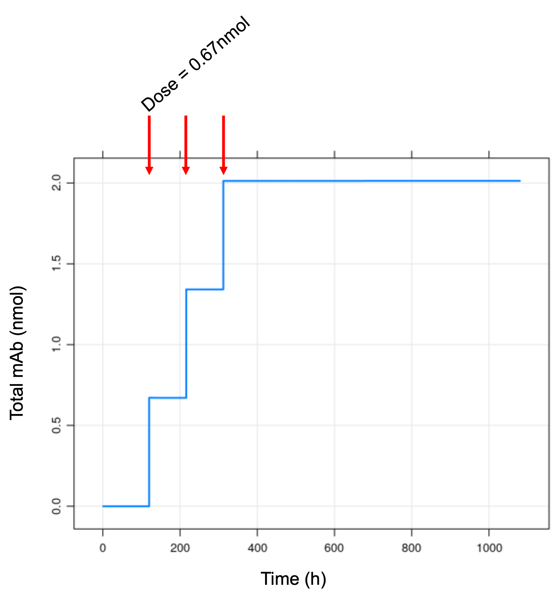

# About

A compartmental PK/PD model of Pembrolizumab's anti-tumor effect implemented in mrgsolve and in Julia. This model is published by [Lindauer et al., CPT Pharmacometrics Syst Pharmacol, 2017](https://www.ncbi.nlm.nih.gov/pmc/articles/PMC5270293/).


**Overview**
- Original purpose/application: 
    - Identify the lowest effective dose of pembrolizumab to be used in clinical studies.
    - Specifically, identify the lowest clinical dose with a high probability of reducing tumor size by >30% (equivalent to the RECIST definition of partial response), across a wide range of scenarios in melanoma
- Key conclusion(s):
    - A translational model captures the dynamics of tumor inhibition by pembrolizumab
    - 2 mg/kg Q3W is suggested as the lowest maximally efficacious dose for clinical trials assessing the efficacy and safety of pembrolizumab
- Basic description:
    - Two-compartment PK model, connected to a physiologic tissue compartment model that includes an equation for PD-1 receptor occupancy, connected to a simple tumor growth model
    - Built using mouse data, scaled up to humans
    - Size of model: ~ 11 ODEs
    - Model structure as follows. 

<p align="center">
  
</p>

**Key assumptions**

- The tumor microenvironment is comparable between species (scaling model from mouse to human):
    - “assume the proportion of volumes of the tumor subcompartments and the blood and lymph flows relative to the total tumor volume are constant across species and tumor entities” 
    - Rate of disappearance (degradation/elimination/internalization) of the antibody-target complex allometrically scaled using an exponent of -0.25
    - Concentration of FcRn receptors in endosomal space of the tumor was the same in mouse and human
    - Tumor growth pattern is exponential
- The concentration of PD-1 receptors in blood and tissue is not known, so assumptions were made about the number of PD-1 receptors on T cells. 
    - Model is sensitive to these parameters


# Prerequisites
R version 4.0.3 and the following R packages:
- mrgsolve
- tidyverse
- gridExtra
- grid
- ggplot2
- mrgsim.parallel
- PKPDmisc
- sensitivity

Julia version 1.6.2 and the following Julia packages:
- DifferentialEquations
- Plots
- CSV
- DataFrames

# Setup

## mrgsolve setup

### package management

1. Install pkgr software following the instructions [here](https://github.com/metrumresearchgroup/pkgr)
2. Open the R project `Lindauer.Rproj`. This allows you to work from within a self-contained project environment.
3. Install packages by typing in terminal: `pkgr install`. This command will look for the file `pkgr.yml` and install the packages listed. The specific package versions are imported from https://mpn.metworx.com/docs/.

### mrgsolve installation
For detailed instructions on mrgsolve installation and important dependencies, follow this link https://github.com/metrumresearchgroup/mrgsolve

Switch directory to folder `script` to reproduce all the figures. 

## Julia setup
Clone the entire repo to your local system, and then switch directory to the folder `Julia_implementation`. All files should be in the same local folder and the above Julia packages should be installed and imported before running a simulation using the `runTest.jl` script.

Alternatively, you can use the provided `Project.toml` and `Manifest.toml` to create a static environment that is an exact snapshot of the environment we used to produce the outputs in this README.md file. For this, after running julia in the main root of this local folder, enter package `Pkg` environment and issue:

```julia
activate .
instantiate
```
And, then you can run a simulation using the `runTest.jl` script.


# Contents
This application contains the following files
1. `pkgr.yml`       (The project file lists the package version and source)
2. `Lindauer.Rproj` (The project file that sets up the working context)
3. `README.md`      (This readme file)

And folders:
1. `img`            (The model verification graphs are stored here)
2. `data`           (Reference results for testing are stored according to their numbering in Lindauer et al., 2017.)
3. `model`          (The mrgsolve-implemented Lindauer model for mouse and human tumor growth are stored here. `Lindauer_mus.cpp` is the for mouse, `Lindauer_homo.cpp` is for human.)
4. `script`          (The model verification and sensitivity analysis. The `verification_Fig*.r` script compare simulation results with corresponding published figures. `LocalSensitivityAnalysis.R` and `GlobalSensitivityAnalysis.r` carry out sensitivity analysis. `MassBalanceVerification.r` verifies mAb mass balance in Lindauer model.)
5. `Julia_implementation` (The Lindauer model ODEs are defined by `Lindauer_mus.jl`.`runRtest.r` creates a data file that contains simlation results using mrgsolve. The outcome is saved in the data folder under the root. `runTest.jl` compares simuation results in Julia with simulation results using mrgsolve.)

# Model verification

## Verification of mass conservation
We verify mAb is mass-conserved in this model. The goal is to check whether there are apparently flaws in the model. In this example, we dose a mouse at hour 120, 216, 312 with 0.67nmol of mAb per dosing. We then track the sum of amount of mAb in the system and those being degraded. After each dosing event, the amount of antibody in mouse jumps by 0.67nmol before stabling at this level until the next dosing event. 

<p align="center">
  
</p>

## Verification of the model implementation using mouse PK data.
We verify our mrgsolve implementation against the original Lindauer model implementation. For example, we compare the results (plasma concentrations) of the mrgsolve simulations against those of the Lindauer model provided by the Lindauer_et_al publication for mouse (Fig S2). In this case, mice are dosed with 0.1, 1, 10mg/kg on day 0, 7, 14 using mAb raised in mouse (79AEA) or with 0.4, 1.4, 5mg/kg  on day 0, 4 using mAb raised in rat (80ADW). 
Shaded areas are 80th percentile interval from 100 simulations, filled circles represent the corresponding mouse plasma mAb concentration.


## Verification of the scaling-up from mouse to human.  
We verify our mrgsolve implementation against the original Lindauer model implementation, scaling up from mouse to human. We simulate 6 scenarios of human tumor growth: fast, median, slow tumor growth, and growth and allometric scaling of mAb-mediated tumor killing. These simulations track tumor shinkage (measured by diameter) with Q3W over 6 months treatment, dose ranging from 0 to 10mg/kg. Shaded areas are 80th percentile interval from 100 simulations. This figure is comparable to Fig3a in Lindauer et al., 2017.

Note the parameters that are used in human is listed in Table 1 in Lindauer et al., 2017. The only other parameter we scaled up from mouse to human is blood volume (V_blood). Here we assume the human blood volume is 5100mL (estimated based on [Mayerson, 1965](https://pubmed.ncbi.nlm.nih.gov/14268875/)), up from 1.4mL used in mouse model. We also change the tumor growth model from exponential-linear to exponential, i.e. we change the tumor growth from 
<p align="center">

</p>
to 
<p align="center">

</p>

Here, *TV* represents tumor volume. We assume this change based on Method section in Lindauer et al., 2017. 


## Verification of model implementation in Julia
We verify our Julia implementation against our implementation in mrgsolve. The virtual mouse is dosed with 10mg/kg mAb at day 0, 7, 14. We remove the random effect in the mrgsolve implementation to make two simulations comparable. We use plasma mAb concentration and tumor size as examples to show these 2 implementations yield same results. 


# Model sensitivity analysis

## Local sensitivity analysis

A sensitivity analysis was performed to determine the effect of any single parameter on change in tumor volume for the 0.1mg/kg doses in the Lindauer model for mouse. Parameter values were changed over a wide range of 0.2× to 5×.
The log ratio for tumor size change is shown using a tornado plot. The green bars show the log value of tumor size change when a parameter is reduced by 20% compared to base parameter value. A negative value on the green bar indicates that tumor size has a more significant shrinkage when this parameter is reduced by five folds. The red bars show the log value of tumor size change when a parameter is reduced by 20% compared to base parameter value. 

The effect of the 6 most sensitive parameters on change from baseline in tumor volume at is summarized in the following figure. Tumor size is sensitive to tumor growth speed (TVL0), PD-1 degradation rate (KdegPD1), and the number of targets/receptors available in blood (N_Tcell, N_PD‐1_TC, V_blood, Tmulti). Note this result is qualitative similar to local sensitivity analysis result conducted by Lindauer et al., 2017 on human with 0.5mg/kg dosing (Figure 4, right panel). 


## Global sensitivity analysis

A sensitivity analysis was performed to determine the effect of any single parameter on change in tumor volume. The goal is to understand the relative contribution from each parameter to tumor volume change. To account for different variability parameters, PK parameters are allowed to have 10% variability, while PD parameters are allowed change 100 folds. This is based on the assumption that tumor can verify greatly from each other, but drug PK should be overall similar. We use Sobel sensitivity analysis published in [Zhang et al., 2015](https://pubmed.ncbi.nlm.nih.gov/27548289/) to achieve our goal. 

Tumor size is sensitive to mAb uptake (TVPLQ, TVCLup), fraction of FcRn recycled in the vascular space (FR), targets/receptors available in blood (V_blood) and tumor (Tmulti), PD-1 degradation rate (KdegPD1), and the linear growth speed of tumor (TVL1). Here the "main effect" is the first‐order sensitivity indices that measure the fractional contribution of a single parameter to the output variance; the "total effect" take into account both the main, second‐order and higher‐order effects, which involves the evaluation over a full range of parameter space. 

There are similarity between the result from global and local sensitivity analysis. For example, they are all sensitive to PD-1 degradation rate (KdegPD1), and the number of targets/receptors available in blood/ tumor (V_blood, Tmulti). However, the global sensitivity analysis shows that the tumor volume is also sensitive to mAb uptake (TVPLQ, TVCLup), fraction of FcRn recycled in the vascular space (FR). These differences could be due to the nonlinear effects in the system, for which global methods are better suited to uncover relationships between multiple parameters. 

Note that global sensitivity analysis is expensive to compute, and the code we provided uses parallel computation and requires large memory (>40GB) to run. To make it less computational intensive, one can reduce the either number of simulations per run (`simulationboot` in line 19) or sampling size per parameter (`sampleperparam` in line 20).


